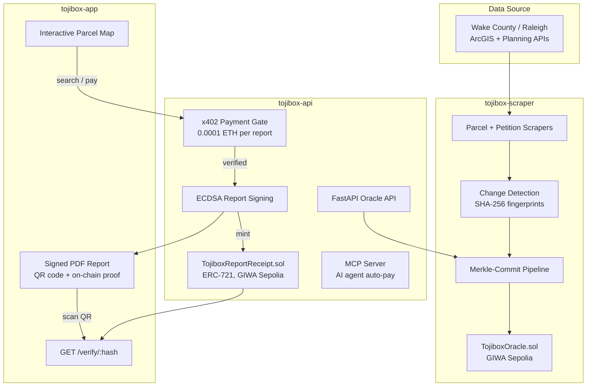

<div align="center">
  <h1>Tojibox</h1>
  <p><strong>The Due Diligence Platform for Real Estate</strong></p>
  <p>Verifiable zoning and parcel history, anchored on-chain. Built on <a href="https://docs.giwa.io">GIWA</a>, an OP-Stack EVM L2.</p>
</div>

---

## Vision

Tojibox's goal is to become the primary due-diligence platform for real estate in the United States: the place a real estate investor, attorney, lender, or Web3 protocol goes to get a fast, cryptographically verifiable zoning and parcel report instead of a multi-week manual vendor process.

The model is live today in Wake County, NC (435,000+ parcels, full rezoning-petition history, on-chain oracle). Wake County is the pilot. The scraping and oracle architecture is built to extend county by county, and the United States has over 3,000 counties and county-equivalents, each holding the same siloed, unstructured zoning data Wake County had. National coverage is the roadmap.

## The Problem

Real estate due diligence, meaning verifying zoning history, rezoning risk, and parcel records before a deal closes, is slow and expensive for nearly everyone who needs it: investors underwriting a purchase, attorneys running title and zoning review, lenders, and Web3 platforms tokenizing or lending against land. Buyers today pay third-party vendors **$12,000–$20,000 per parcel** and wait **1–2 weeks** for a static, one-time answer.

The root cause is that zoning history and rezoning-petition records are siloed at the county level, unstructured, and require manual aggregation. This problem repeats identically across all 3,000+ US counties. On top of that, the resulting report is an unverifiable PDF. Every counterparty has to trust the vendor, because there is no cryptographic proof the report is authentic, current, or untampered.

## The Solution

Tojibox converts county parcel and rezoning data into a cryptographically verifiable on-chain oracle, starting with Wake County, NC as the pilot market.

1. A scraping pipeline continuously ingests parcel and rezoning-petition data from the county's public ArcGIS and planning APIs.
2. Detected changes are batched, hashed into a Merkle tree, and committed on-chain to `TojiboxOracle.sol` on GIWA, producing an immutable, publicly verifiable audit trail of every zoning change.
3. A user searches a parcel, gets a free preview, then pays a small x402 fee (0.0001 ETH) to unlock the full due-diligence report.
4. The report is ECDSA-signed by the oracle. Its hash is minted as an ERC-721 receipt (`TojiboxReportReceipt.sol`) directly on GIWA, giving it durable on-chain storage instead of an in-memory record that disappears on a server restart.
5. Anyone can verify a report's authenticity in seconds, either by scanning the QR code on the PDF or by calling `/verify/{hash}`, which checks chain state directly. No trust in Tojibox is required.

Due diligence goes from $12,000–$20,000 and two weeks to on-demand and cryptographically verifiable, for a fraction of a cent in fees. The same pipeline is built to onboard additional counties.

## Architecture



## Tech Stack

| Layer | Technology | Role |
|---|---|---|
| Settlement | **GIWA** (OP-Stack EVM L2, Sepolia testnet, chain ID `91342`) | Every trust-critical write, including Merkle-batch commits and report receipts, lands on a plain EVM contract. No custom SDK, no sidecar process. |
| Oracle | **Chainlink CRE** | A 3-node BFT-consensus scraping and hashing pipeline turns fragmented county data into a single agreed-upon Merkle root before it is committed on-chain. |
| Payments | **x402** | HTTP 402 payment gate, 0.0001 ETH per report, verified directly against GIWA's JSON-RPC (`eth_getTransactionReceipt`), with replay protection. |
| Identity | **ENS** (`tojibox.eth`, planned) | Human-readable, chain-agnostic identity for the oracle's signing key, verifiable independent of Tojibox's own servers. |
| AI agents | **MCP Server** | Exposes parcel-query tools to any MCP-compatible AI agent. Autonomously pays x402 fees via `ethers.js` when it receives a 402. |
| Backend | FastAPI (Python), `web3.py`, `eth-account` | Oracle serving layer, payment verification, ECDSA signing, and direct on-chain contract calls. |
| Frontend | React, Vite, Mapbox GL JS, jsPDF | Interactive 434k-parcel map, wallet-gated report downloads, and public report verification. |
| Data | Supabase (PostgreSQL) | 435,000+ Wake County parcels and 2,000+ rezoning petitions, updated live. |

## Smart Contracts (GIWA Sepolia)

| Contract | Address | Purpose |
|---|---|---|
| `TojiboxOracle` | [`0xDE4694B4A79E622E7Bc755707066932F7cdDFe30`](https://sepolia-explorer.giwa.io/address/0xDE4694B4A79E622E7Bc755707066932F7cdDFe30) | Stores Merkle roots per commit batch, indexes affected parcel PINs, and exposes `verify(leaf, proof, batchId)` so anyone can cryptographically confirm a zoning change is real. |
| `TojiboxReportReceipt` | [`0x5cF29e961631F78742c475f0aE77Ab779B2bEAf6`](https://sepolia-explorer.giwa.io/address/0x5cF29e961631F78742c475f0aE77Ab779B2bEAf6) | An ERC-721 receipt minted per paid report. Stores the report hash, parcel PIN, oracle address, and timestamp directly in contract state, so proof survives a backend restart instead of relying on an in-memory record. |

## Repositories

| Repo | Owns |
|---|---|
| [`tojibox-scraper`](https://github.com/tojibox/tojibox-scraper) | Parcel and rezoning-petition scraping, change detection, the Merkle-commit pipeline, and `TojiboxOracle.sol` |
| [`tojibox-api`](https://github.com/tojibox/tojibox-api) | FastAPI oracle serving layer, x402 payment gate, report signing, `TojiboxReportReceipt.sol`, and the MCP server |
| [`tojibox-app`](https://github.com/tojibox/tojibox-app) | React/Vite frontend for the parcel map, payment flow, and report verification |

## The Full Due-Diligence Flow

```
1. User searches a property address or PIN on the Tojibox map
2. Free preview shows petition count, no payment required
3. User pays 0.0001 ETH via x402 to unlock the full report
4. Oracle signs the report with its ECDSA key (secp256k1 / EIP-191)
5. Report hash is minted as a TojiboxReportReceipt NFT on GIWA
6. User downloads a PDF with the seal, QR code, and on-chain proof
7. Anyone scans the QR to reach /verify/hash and check the signature and on-chain receipt
```

---

<div align="center">
  <sub>Chainlink CRE + GIWA + Wake County GIS</sub>
</div>
